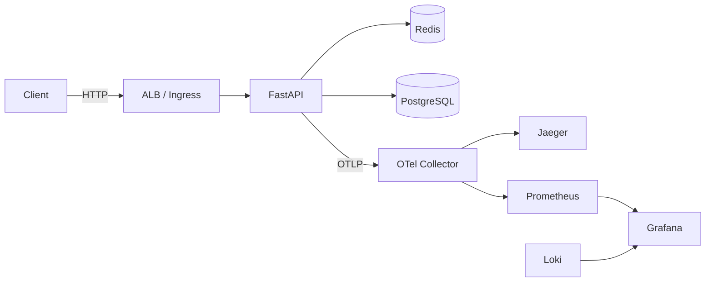

# Shrinkr

[](https://github.com/a-borychevskyi/shrinkr/actions/workflows/ci.yml)

A production-grade URL shortener with analytics and full observability, built to demonstrate backend and DevOps skills.

## Architecture



**Request flow:** Client hits the FastAPI app through a load balancer. Short-link redirects check Redis first (cache hit) and fall back to PostgreSQL on a miss. Click stats are recorded per redirect. All requests are traced end-to-end via OpenTelemetry.

### Layers

| Layer | Package | Responsibility |
|-------|---------|----------------|
| API | `src.api` | FastAPI routers, Pydantic schemas, exception handlers |
| Services | `src.services` | Business logic (URL CRUD, click tracking) |
| Repositories | `src.repositories` | Data access — PostgreSQL and Redis cache |
| ORM | `src.orm` | SQLAlchemy 2.0 models, filters, sorters |
| DI | `src.di` | Dependency providers wired via `Depends()` |

## Tech Stack

| Component | Technology |
|-----------|------------|
| Language | Python 3.12 |
| Framework | FastAPI (async) |
| Database | PostgreSQL 18 via SQLAlchemy 2.0 + asyncpg |
| Cache / Rate Limiting | Redis 7 |
| Observability | OpenTelemetry, Prometheus, Grafana, Loki, Jaeger |
| Logging | structlog (JSON in prod, pretty-print in dev) |
| Containerisation | Docker (multi-stage), Docker Compose |
| Linting | ruff |
| Testing | pytest + httpx |

## Quick Start

```bash
# Clone and start all services
git clone https://github.com/a-borychevskyi/shrinkr.git
cd shrinkr
docker compose -f docker/compose.yml up --build
```

The API is now running at `http://localhost:8000`.

| URL | Service |
|-----|---------|
| [localhost:8000/docs](http://localhost:8000/docs) | Swagger UI |
| [localhost:8000/redoc](http://localhost:8000/redoc) | ReDoc |
| [localhost:3000](http://localhost:3000) | Grafana (admin/admin) |
| [localhost:16686](http://localhost:16686) | Jaeger UI |
| [localhost:9090](http://localhost:9090) | Prometheus |
| [localhost:5540](http://localhost:5540) | RedisInsight |

## API

All endpoints are versioned under `/v0`.

### URLs

| Method | Path | Description |
|--------|------|-------------|
| `POST` | `/v0/shortner/` | Create a short link |
| `GET` | `/{short_code}` | Redirect to the original URL (302) |
| `POST` | `/v0/shortner/deactivate` | Soft-delete (deactivate) a link |
| `POST` | `/v0/shortner/activate` | Re-activate a link |
| `DELETE` | `/v0/shortner/{short_code}` | Permanently delete a link |

### Analytics

| Method | Path | Description |
|--------|------|-------------|
| `GET` | `/v0/shortner/url_stats/` | Click stats for a short link |

### System

| Method | Path | Description |
|--------|------|-------------|
| `GET` | `/v0/system/health` | Liveness probe |
| `GET` | `/v0/system/ready` | Readiness probe (DB + Redis) |

### Error format

```json
{
  "status": "error",
  "error": {
    "code": "NOT_FOUND",
    "message": "Link not found"
  }
}
```

### Rate limiting

Link creation and stats endpoints are rate-limited per IP using a sliding-window counter in Redis.
When the limit is exceeded the API returns `429` with `Retry-After`, `X-RateLimit-Limit`, and `X-RateLimit-Remaining` headers.

## Project Structure

```
src/
├── api/            # FastAPI routers and Pydantic schemas (versioned under v0)
├── config/         # pydantic-settings configuration classes
├── di/             # Dependency injection providers
├── models/         # Domain models (Pydantic)
├── orm/            # SQLAlchemy models, filters, sorters
├── repositories/   # Data access (PostgreSQL + Redis cache)
├── services/       # Business logic
├── utils/          # Exceptions, enums, helpers
├── logging.py      # structlog setup
├── telemetry.py    # OpenTelemetry setup
└── main.py         # App entry point
```

## Design Decisions

**Repository pattern** — Database access is abstracted behind repository classes so services never touch SQLAlchemy directly. This makes unit testing straightforward with mocks and keeps business logic decoupled from the ORM.

**Dependency injection via `Depends()`** — No global state. Every dependency (DB session, Redis client, services) is resolved through FastAPI's DI system, making the app easy to test with different configurations.

**App factory** — `create_app()` in `src.api.app` accepts configuration and returns a fully wired FastAPI instance. Tests can create isolated app instances with overridden settings.

**Async everywhere** — async SQLAlchemy (asyncpg), async Redis, async request handling. No sync blocking code in the request path.

**Sliding-window rate limiter** — Implemented with a Lua script in Redis for atomicity. Weighs the previous window's request count by the proportion of the current window elapsed, avoiding the boundary-spike problem of fixed-window counters.

**Cache-aside pattern** — Hot links are cached in Redis with a TTL. Redirects check the cache first; misses fall through to PostgreSQL. Entries are invalidated on delete.

**Unit of Work** — Database sessions are wrapped in a UoW context manager to guarantee transactional consistency across multiple repository calls.

## Development

```bash
# Install all dependencies including dev tools
uv sync --group dev

# Set up pre-commit hooks (ruff format, ruff check, mypy)
uv run pre-commit install
```

Pre-commit hooks run automatically on every `git commit`. To run them manually against all files:

```bash
uv run pre-commit run --all-files
```

## Testing

```bash
# Run all tests
uv run pytest

# Run with coverage report
uv run pytest --cov=src --cov-report=term-missing

# Unit tests only
uv run pytest tests/unit/

# API tests only
uv run pytest tests/api/
```

Tests are split into two layers:

- **Unit tests** (13 files) — mock external dependencies, test services, schemas, models, rate limiter logic, exception handling, and DI factories.
- **API tests** (4 files) — use httpx `AsyncClient` against the FastAPI app to test full request/response cycles including redirects, rate limiting, and health checks.

Minimum coverage threshold: **70%** (enforced in `pyproject.toml`).

## Observability

The full monitoring stack runs alongside the app in Docker Compose:

- **Structured logging** — structlog outputs JSON in production and pretty-printed logs in development. Logs are scraped by Promtail and aggregated in Loki.
- **Distributed tracing** — OpenTelemetry auto-instruments FastAPI, SQLAlchemy, and Redis. Traces are exported via OTLP to Jaeger through the OTel Collector.
- **Metrics** — Prometheus scrapes application metrics (cache hit/miss rates, DB operation counts, rate-limit rejections). Four pre-built Grafana dashboards ship with the project: application overview, Redis metrics, SQL metrics, and a load-testing dashboard (see *Performance*).

## Performance

The redirect hot path was stress-tested with Locust (see [`load/`](load/)) and iteratively tuned using the built-in Prometheus + Grafana stack. Each step below only became visible *after* the previous bottleneck was removed.

**Changes, in order applied:**

1. Click tracking off the redirect critical path — synchronous `INSERT` → `BackgroundTask` → in-process batching queue.
2. Dropped per-query SQL INFO log and per-429 WARN log — blocking stdout writes were stalling the async event loop (app CPU sat at ~1% while p95 was pinned at 240 ms).
3. Flipped to JSON logs (production mode) and parametrized gunicorn worker count via `WEB_CONCURRENCY`.
4. `@lru_cache` on the async Redis client — request-scoped instantiation was exhausting the kernel's ephemeral-port range under load.
5. Right-sized the SQLAlchemy pool against Postgres `max_connections` via `DB_POOL_SIZE` / `DB_MAX_OVERFLOW`.
6. Batched click ingestion — the redirect handler enqueues a `ClickEvent`; a background consumer drains the queue every 100 ms and flushes via a single multi-row `INSERT` per batch, no `RETURNING`.

**Result — same infrastructure, 250 concurrent users:**

| Signal                   | Baseline | Optimized   |
|--------------------------|----------|-------------|
| Throughput               | 268 rps  | **1,803 rps** |
| `GET /{short_code}` p95  | 240 ms   | **87 ms**   |
| p99 overall              | 386 ms   | **100 ms**  |
| Postgres CPU at peak     | 97 %     | **13 %**    |
| Failures                 | 0        | 0           |

Reproduce it yourself:

```bash
docker compose -f docker/compose.yml --profile load up --build
```

Then drive load from the Locust UI at `http://localhost:8089` and watch live RPS and latency on the **Shrinkr / Locust** dashboard in Grafana (`http://localhost:3000`).

## Docker

The `Dockerfile` uses a **multi-stage build**:

1. **Builder stage** — installs dependencies with `uv sync` (no dev deps).
2. **Runtime stage** — copies only the virtualenv and source code into a `python:3.12-slim` image. Runs as a non-root `app` user with a built-in health check.

Production entrypoint: Gunicorn with 4 Uvicorn workers.

## CI/CD

GitHub Actions pipeline (`.github/workflows/ci.yml`) runs on every push to `main` and every pull request.

| Job | Runs | Purpose |
|-----|------|---------|
| `lint` | `ruff check` + `ruff format --check` on `src/` and `tests/` | Style and formatting |
| `typecheck` | `mypy` (configured via `pyproject.toml`) | Static type analysis |
| `test` | `pytest` with 70% coverage gate | Unit, API, and integration tests (testcontainers spins up real Postgres + Redis) |
| `build-and-push` | Docker Buildx multi-stage build; push to GHCR on `main` | Container delivery |

`lint`, `typecheck`, and `test` run in parallel for fast feedback. `build-and-push` gates on all three passing. Push to the registry is skipped on pull requests — PRs only validate the build.

Pre-commit hooks (`ruff-format`, `ruff`, `mypy`) mirror the `lint` and `typecheck` jobs so most failures surface locally before a commit lands.

## Documentation

Sphinx-based documentation with auto-generated API reference:

```bash
# Install docs dependencies
uv sync --group docs

# Build HTML docs
python -m sphinx -b html docs docs/_build/html

# View locally
python -m http.server -d docs/_build/html 8080
```

## What I'd Improve

- **Authentication** — API key or JWT-based auth for link management.
- **Terraform** — AWS infrastructure as code (VPC, RDS, ElastiCache, ECS Fargate, ALB).
- **Kubernetes** — Deployment manifests, Helm chart, HPA autoscaling.
- **Analytics pipeline** — Kafka for durable, cross-worker click ingestion (current impl is an in-process batched queue per worker) and ClickHouse for analytical queries.
- **Geo-distributed caching** — CDN or edge caching for redirect latency.
- **Custom alias and expiration** — Let users choose their own short codes and set link expiry.
